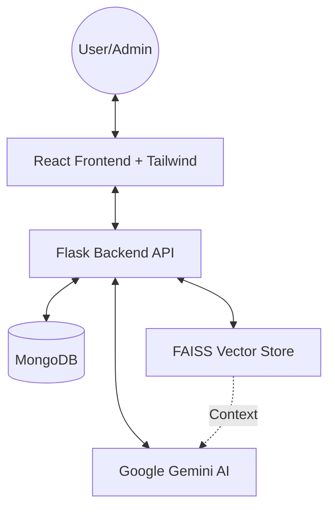

# NeuraPulse AI - System Design & Documentation

This document provides a technical deep-dive into the architecture, data structures, and system design of the NeuraPulse AI personal healthcare companion.

---

## 1. System Architecture

NeuraPulse AI follows a **Client-Server Architecture** with a clear separation between the frontend presentation layer and the backend logic/AI layer.

### Component Breakdown
- **Frontend**: A single-page application (SPA) built with React and TypeScript, using Shadcn/UI for a premium design.
- **Backend**: A RESTful API built with Flask, organizing logic into modular blueprints (Routes).
- **Inference Layer**: Uses Google Gemini Flash for natural language processing and image analysis.
- **Retrieval Layer**: Uses FAISS for Retrieval-Augmented Generation (RAG) to ground AI responses in specific medical guidelines.

---

## 2. Database Design (MongoDB)

The system uses MongoDB for flexible, document-based storage. Key collections are listed below:

| Collection | Description | Primary Fields |
| :--- | :--- | :--- |
| `users` | User credentials and profile | `email`, `password_hash`, `role` (user/admin), `full_name` |
| `appointments` | Booking requests and status | `user_id`, `doctor_name`, `date`, `status` (pending/approved) |
| `doctors` | Directory of specialists | `name`, `specialty`, `availability`, `image_url` |
| `health_logs` | User-logged vitals and mood | `user_id`, `sleep_hours`, `energy_level`, `mood`, `log_date` |
| `medications` | Medication tracking data | `user_id`, `name`, `dosage`, `frequency`, `last_taken` |
| `notifications` | System alerts for users | `user_id`, `title`, `message`, `is_read`, `created_at` |

---

## 3. API Reference

### Authentication & Profile
| Method | Endpoint | Description |
| :--- | :--- | :--- |
| POST | `/api/auth/register` | Register a new user |
| POST | `/api/auth/login` | Authenticate and receive JWT |
| GET | `/api/profile` | Retrieve user profile data |
| PUT | `/api/profile/update` | Update user metadata/avatar |

### Healthcare Features
| Method | Endpoint | Description |
| :--- | :--- | :--- |
| POST | `/api/chat` | AI Chat with RAG context integration |
| GET | `/api/health-logs` | Retrieve historical health data |
| POST | `/api/appointments` | Request a new appointment |
| GET | `/api/medications` | List user medications |
| POST | `/api/image-analysis` | Analyze medical images (rashes, etc.) |

### Admin Layer
| Method | Endpoint | Description |
| :--- | :--- | :--- |
| GET | `/api/admin/stats` | System-wide statistics (counts, etc.) |
| GET | `/api/admin/users` | List all registered users |
| PUT | `/api/appointments/<id>/status` | Approve or Reject an appointment |

---

## 4. AI/ML Workflows

### Retrieval-Augmented Generation (RAG)
When a user asks a medical question, the system follows this workflow:
1. **Embedding**: The user's query is converted into a vector using `embedding-001`.
2. **Search**: The vector is compared against the `FAISS` store (loaded from `medical_guidelines.txt`).
3. **Augmentation**: Relevant medical context is injected into the prompt.
4. **Generation**: Gemini generates a response anchored in that context.

### Predictive Engine (WMA)
The `WellnessForecast` uses a **Weighted Moving Average** algorithm:
$$Score = (Sleep \times 0.4) + (Energy \times 0.3) + (Mood \times 0.3)$$
Most recent logs are weighted more heavily (x7 for the latest day) to detect sudden dips in wellness.

---

## 5. Security & Auth Flow

1. **Password Security**: Passwords are hashed using `Bcrypt` before storage.
2. **JWT Authorization**: 
   - On login, the server issues a signed JWT.
   - The frontend stores this token in `localStorage`.
   - All protected routes require the `Authorization: Bearer <token>` header.
3. **RBAC**: Role-Based Access Control ensures only accounts with `role: "admin"` can access the Admin Dashboard and approval routes.

---

## 📂 File Structure Detail

### Backend (Flask)
- `rag_utils.py`: Manage FAISS vector store and embeddings.
- `database.py`: MongoDB connection singleton.
- `routes/`: Modularized endpoint definitions.

### Frontend (React)
- `src/components/ui/`: Atomic Shadcn components.
- `src/utils/predictionEngine.ts`: Client-side ML logic for forecasting.
- `src/lib/api.ts`: Axios wrapper for centralized API calls.
